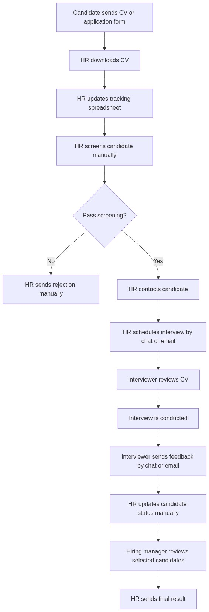
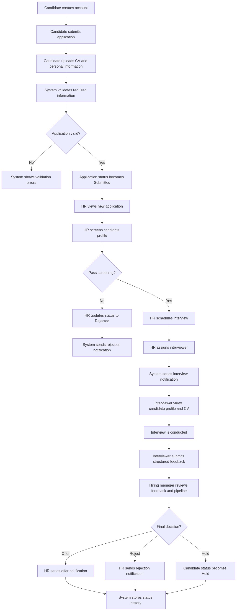

# InternshipHub - Business Analyst Portfolio Project

## Project Highlights
This Business Analyst portfolio showcases a comprehensive, end-to-end requirement engineering process for an internship recruitment management system. The repository includes:
- **Business Requirements Document (BRD)** & **Software Requirements Specification (SRS)**
- **Stakeholder Analysis** & **RACI Matrix**
- **AS-IS and TO-BE Process Workflows** (Mermaid & PNG diagrams)
- **Agile Backlog & User Stories** with **Acceptance Criteria** (Given-When-Then format)
- **Wireframe Specifications** (low-fidelity screen design)
- **Test Scenarios** & **Requirement Traceability Matrix (RTM)**

---

## 1. Project Overview

**InternshipHub** is a Business Analyst portfolio case study for an internship application and interview management system.

The system is designed to help companies manage internship recruitment in one centralized workflow, from candidate application submission to interview feedback and final hiring decision.

This repository focuses on Business Analyst artifacts, not full software implementation. It demonstrates how a BA analyzes business problems, documents requirements, models workflows, supports Agile backlog creation, and prepares testable requirements for development and QA teams.

---

## 2. How to Use This Repository
For recruiters and hiring managers reviewing this portfolio, it is recommended to read the artifacts in the following logical sequence:
1. **[Project Overview](internshiphub-ba-portfolio/docs/00_project_overview.md)** - Understand the project's background and objectives.
2. **[Stakeholder Analysis](internshiphub-ba-portfolio/docs/01_stakeholder_analysis.md)** - Identify key users, their pain points, goals, and the RACI matrix.
3. **[AS-IS Process Analysis](internshiphub-ba-portfolio/docs/02_as_is_process.md)** & **[TO-BE Process Analysis](internshiphub-ba-portfolio/docs/03_to_be_process.md)** - Compare the current manual flow with the proposed system flow.
4. **[Business Requirements Document (BRD)](internshiphub-ba-portfolio/docs/04_brd_business_requirements.md)** - Review high-level business objectives and rules.
5. **[Software Requirements Specification (SRS)](internshiphub-ba-portfolio/docs/05_srs_software_requirements.md)** - Dive into detailed functional/non-functional requirements, data schemas, and validation rules.
6. **[User Stories and Product Backlog](internshiphub-ba-portfolio/docs/06_user_stories_product_backlog.md)** - See the breakdown of features into user stories and MVP sprint backlog.
7. **[Acceptance Criteria](internshiphub-ba-portfolio/docs/07_acceptance_criteria.md)** - Check the detailed requirements in Given-When-Then format.
8. **[Wireframe Specification](internshiphub-ba-portfolio/docs/08_wireframe_specification.md)** - Explore screen layouts and user interface definitions.
9. **[Test Scenarios](internshiphub-ba-portfolio/docs/09_test_scenarios.md)** - Review system verification scenarios and test cases.
10. **[Requirement Traceability Matrix (RTM)](internshiphub-ba-portfolio/docs/10_requirement_traceability_matrix.md)** - Trace business rules and functional requirements to user stories and test scenarios.
11. **[BA Interview Story](internshiphub-ba-portfolio/docs/11_ba_interview_story.md)** - Read the case study reflection and interview preparation story.

---

## 3. Business Problem

Many companies manage internship recruitment through email, spreadsheets, chat tools, and manual notes. This process becomes difficult to control when the number of candidates increases.

Key problems include:

- Candidate information is stored in many places.
- HR needs to update candidate status manually.
- Candidates do not know their current application status.
- Interview feedback is not standardized.
- Hiring managers cannot easily view the full recruitment pipeline.
- There is no clear status history for audit and tracking.

---

## 4. Proposed Solution

InternshipHub centralizes the recruitment workflow by allowing:

- Candidates to submit applications and track status.
- HR recruiters to screen candidates, update status, and schedule interviews.
- Interviewers to view assigned candidates and submit structured feedback.
- Hiring managers to view pipeline data and approve final decisions.
- Admins to manage users, roles, and internship programs.

---

## 5. BA Artifacts Included

| Artifact | File |
|---|---|
| Project Overview | [internshiphub-ba-portfolio/docs/00_project_overview.md](internshiphub-ba-portfolio/docs/00_project_overview.md) |
| Stakeholder Analysis | [internshiphub-ba-portfolio/docs/01_stakeholder_analysis.md](internshiphub-ba-portfolio/docs/01_stakeholder_analysis.md) |
| AS-IS Process Analysis | [internshiphub-ba-portfolio/docs/02_as_is_process.md](internshiphub-ba-portfolio/docs/02_as_is_process.md) |
| TO-BE Process Analysis | [internshiphub-ba-portfolio/docs/03_to_be_process.md](internshiphub-ba-portfolio/docs/03_to_be_process.md) |
| Business Requirements Document | [internshiphub-ba-portfolio/docs/04_brd_business_requirements.md](internshiphub-ba-portfolio/docs/04_brd_business_requirements.md) |
| Software Requirements Specification | [internshiphub-ba-portfolio/docs/05_srs_software_requirements.md](internshiphub-ba-portfolio/docs/05_srs_software_requirements.md) |
| User Stories and Product Backlog | [internshiphub-ba-portfolio/docs/06_user_stories_product_backlog.md](internshiphub-ba-portfolio/docs/06_user_stories_product_backlog.md) |
| Acceptance Criteria | [internshiphub-ba-portfolio/docs/07_acceptance_criteria.md](internshiphub-ba-portfolio/docs/07_acceptance_criteria.md) |
| Wireframe Specification | [internshiphub-ba-portfolio/docs/08_wireframe_specification.md](internshiphub-ba-portfolio/docs/08_wireframe_specification.md) |
| Test Scenarios | [internshiphub-ba-portfolio/docs/09_test_scenarios.md](internshiphub-ba-portfolio/docs/09_test_scenarios.md) |
| Requirement Traceability Matrix | [internshiphub-ba-portfolio/docs/10_requirement_traceability_matrix.md](internshiphub-ba-portfolio/docs/10_requirement_traceability_matrix.md) |
| BA Interview Story | [internshiphub-ba-portfolio/docs/11_ba_interview_story.md](internshiphub-ba-portfolio/docs/11_ba_interview_story.md) |

---

## 6. Diagram Files

| Diagram | Source File | Rendered Image |
|---|---|---|
| AS-IS Process Diagram | [internshiphub-ba-portfolio/diagrams/as_is_process.mmd](internshiphub-ba-portfolio/diagrams/as_is_process.mmd) | [assets/as_is_process.png](assets/as_is_process.png) |
| TO-BE Process Diagram | [internshiphub-ba-portfolio/diagrams/to_be_process.mmd](internshiphub-ba-portfolio/diagrams/to_be_process.mmd) | [assets/to_be_process.png](assets/to_be_process.png) |

### AS-IS Process Diagram


### TO-BE Process Diagram


---

## 7. Repository Structure

```text
├── README.md
├── assets/
│   ├── as_is_process.png
│   └── to_be_process.png
└── internshiphub-ba-portfolio/
    ├── docs/
    │   ├── 00_project_overview.md
    │   ├── 01_stakeholder_analysis.md
    │   ├── 02_as_is_process.md
    │   ├── 03_to_be_process.md
    │   ├── 04_brd_business_requirements.md
    │   ├── 05_srs_software_requirements.md
    │   ├── 06_user_stories_product_backlog.md
    │   ├── 07_acceptance_criteria.md
    │   ├── 08_wireframe_specification.md
    │   ├── 09_test_scenarios.md
    │   ├── 10_requirement_traceability_matrix.md
    │   └── 11_ba_interview_story.md
    ├── diagrams/
    │   ├── as_is_process.mmd
    │   └── to_be_process.mmd
    └── templates/
        ├── stakeholder_interview_questions.md
        ├── requirement_template.md
        └── change_request_template.md
```

---

## 8. BA Skills Demonstrated

| BA Skill | Evidence in This Repository |
|---|---|
| Business problem analysis | Project overview, business problem, business objectives |
| Stakeholder analysis | Stakeholder list, goals, pain points, RACI matrix |
| Process modeling | AS-IS and TO-BE process analysis |
| Requirement documentation | BRD and SRS |
| Agile requirement writing | Epics, user stories, product backlog, MVP backlog |
| Acceptance criteria writing | Given-When-Then acceptance criteria |
| Wireframe thinking | Low-fidelity wireframe specification |
| QA collaboration | Test scenarios and expected results |
| Traceability | Requirement Traceability Matrix |
| Change awareness | Change request template and gap analysis |

---

## 9. Key Project Scope

### In Scope

- Candidate registration and login
- Candidate profile and CV upload
- Internship application submission
- Candidate status tracking
- HR candidate management
- Candidate status updates
- Interview scheduling
- Interviewer feedback submission
- Hiring manager pipeline view
- Admin user and role management
- Requirement traceability and test scenarios

### Out of Scope

- AI-based CV screening
- Online coding test
- Payroll management
- Employee onboarding
- Integration with external HRM systems
- Full production-level source code
